# SISOP-2-2026-IT-002
## Soal 1
Pada soal ini, Program digunakan untuk:
- Membuat direktori `brankas_kedai`
- Memindahkan file tertentu ke dalam folder tersebut
- Melakukan kompresi (zip)
### Kode Lengkap
```c
#include <stdio.h>
#include <stdlib.h>
#include <unistd.h>
#include <sys/wait.h>

void error_exit(){
    printf("[ERROR] Aiyaa! Proses gagal, file atau folder tidak ditemukan.\n") ;
    exit(EXIT_FAILURE) ;
}

void jalankan_perintah(char *path,char *argv[]) {
    pid_t pid;
    int status;

    pid = fork();

    if (pid < 0){
        error_exit();
    }
    if (pid==0) {
        execv(path, argv);
        exit(EXIT_FAILURE);
    } else {
        if (waitpid(pid, &status, 0) == -1) {
            error_exit() ;
        }
        if (!WIFEXITED(status) || WEXITSTATUS(status) != 0){
            error_exit();
        }
    }
}

int main() {
    char *mkdir_args[] = {"mkdir", "brankas_kedai",NULL} ;
    char *cp_args[] = {"cp", "buku_hutang.csv", "brankas_kedai/", NULL};
    char *grep_args[] = {
        "sh", "-c",
        "grep 'Belum Lunas' brankas_kedai/buku_hutang.csv > brankas_kedai/daftar_penunggak.txt",
        NULL
    } ;

    char *zip_args[] = {"zip", "-r", "rahasia_muthu.zip", "brankas_kedai", NULL};

        jalankan_perintah("/bin/mkdir", mkdir_args);

        jalankan_perintah("/bin/cp", cp_args);

        jalankan_perintah("/bin/sh", grep_args);

        jalankan_perintah("/usr/bin/zip", zip_args);

    printf("[INFO] Fuhh, selamat! Buku hutang dan daftar penagihan berhasil diamankan.\n");

    return 0;
}
```
### Penjelasan Kode 
#### 1. Membuat Folder
```c
system("mkdir brankas_kedai");
```
Tujuan untuk membuat folder `brankas_kedai` sebagai tempat penyimpanan file.
#### 2. Memindahkan File
```c
system("mv buku_hutang.csv daftar_penunggak.txt brankas_kedai/");
```
Tujuan untuk memindahkan file yang dibutuhkan ke folder `brankas_kedai.`
#### 3. Kompresi File
```c
system("zip -r brankas_kedai.zip brankas_kedai");
```
Tujuan untuk mengarsipkan folder `brankas_kedai` menjadi file zip.
### Cara Menjalankan
```
gcc kasir_muthu.c -o kasir_muthu
./kasir_muthu
cat brankas_kedai/daftar_penunggak.txt
```
### Output
1. menjalankan program baru `./kasir_muthu.c`
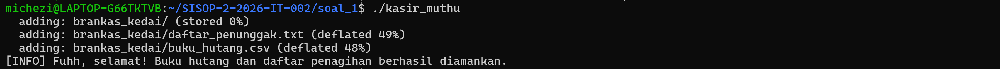
2. menjalankan program `./kasir_muthu.c` yang pernah dibuat sebelumnya
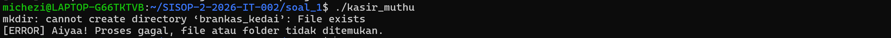
3. melihat Daftar Penunggak
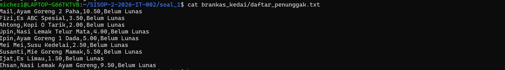

## Soal 2
Pada Soal ini diminta Program daemon yang:
- Membuat file `contract.txt`
- Menulis log ke `work.log`
- Memantau perubahan file
- Mengembalikan file jika diubah atau dihapus
- Menampilkan pesan saat daemon dihentikan
### Kode Lengkap
```c
#include <stdio.h>
#include <stdlib.h>
#include <unistd.h>
#include <sys/stat.h>
#include <sys/types.h>
#include <string.h>
#include <time.h>
#include <signal.h>

char expected_content[1024] ;
volatile sig_atomic_t running = 1;

void tulis_log(char *pesan) {
    FILE *fp = fopen("work.log", "a");
    if (fp != NULL) {
        fprintf(fp, "%s\n", pesan);
        fclose(fp);
    }
}

void handle_signal(int sig) {
    tulis_log("We really weren’t meant to be together");
    running = 0;
}

void buat_contract(int restored ){
  FILE *fp = fopen("contract.txt", "w");
        if (fp == NULL) return ;

        time_t now = time(NULL) ;
        char *time_str = ctime(&now) ;

    if (restored) {
        sprintf(expected_content,
                "\"A promise to keep going, even when unseen.\"\nrestored at: %s",
                time_str);
    } else {
        sprintf(expected_content,
                "\"A promise to keep going, even when unseen.\"\ncreated at: %s",
                time_str);
    }
   fputs(expected_content, fp);
    fclose(fp);
}

int file_sama() {
    FILE *fp = fopen("contract.txt", "r");
    if (fp == NULL) return 0;

        char buffer[1024];
        size_t n = fread(buffer, 1, sizeof(buffer) - 1, fp);
        buffer[n] = '\0';

        fclose(fp) ;

    return strcmp(buffer,expected_content) == 0;
}

int main() {
    pid_t pid = fork();

    if (pid < 0) exit(EXIT_FAILURE);
    if (pid > 0) exit(EXIT_SUCCESS);

    umask(0);

    if (setsid() < 0) exit(EXIT_FAILURE);
    chdir(".");

        signal(SIGTERM, handle_signal);
        signal(SIGINT, handle_signal);

    srand(time(NULL));
    buat_contract(0);

    char *status_list[] = {"[awake]", "[drifting]", "[numbness]"};
    int counter = 0;

    while (running) {
        sleep(1);
        counter++;

        if (access("contract.txt", F_OK) != 0) {
            buat_contract(1);
        } else if (!file_sama()) {
            tulis_log("contract violated.");
            buat_contract(1);
        }
        if (counter >= 5) {
            char log[100];
            sprintf(log, "still working... %s", status_list[rand() % 3]);
            tulis_log(log);
            counter = 0;
        }
    }

    return 0;
}
```
### Penjelasan Kode 
#### 1. Membuat Daemon
```c
pid_t pid = fork();
if (pid > 0) exit(EXIT_SUCCESS);
setsid();
```
Tujuan untuk memindahkan proses ke background agar berjalan sebagai daemon.
#### 2. Menangani signal
```c
signal(SIGTERM, handle_signal);
```
Tujuan agar saat daemon dihentikan dengan kill, program menulis pesan terakhir ke log.

#### 3. Membuat file contract
```c
buat_contract(0);
```
Tujuan untuk membuat file contract.txt pertama kali saat daemon dijalankan.

#### 4. Mengecek file hilang
```c
if (access("contract.txt", F_OK) != 0) {
    buat_contract(1);
}
```
Tujuan jika file dihapus, daemon otomatis membuat ulang file.

#### 5. Mengecek isi file berubah
```c
else if (!file_sama()) {
    tulis_log("contract violated.");
    buat_contract(1);
}
```
Tujuan jika isi file diubah, daemon menulis log pelanggaran lalu memulihkan isi file.

#### 6. Logging tiap 5 detik
```c
if (counter >= 5) {
    sprintf(log, "still working... %s", status_list[rand() % 3]);
    tulis_log(log);
    counter = 0;
}
```
Tujuan untuk menulis status acak ke `work.log` setiap 5 detik.
### Cara Menjalankan
```
gcc contract_daemon.c -o contract_daemon
./contract_daemon
tail -f  work.log
// ubah file
echo "rusak" > contract.txt
cat work.log
// hapus file
rm contract.txt
ls
//ambil PID
pgrep -a contract_daemon
kill PID
sleep 1
tail -n 5 work.log
```
### Output
1. mejalankan daemon dan melihat log berjalan
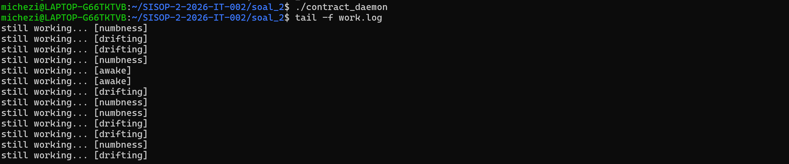
2. mengubah isi file
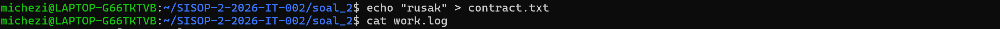
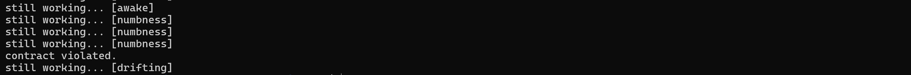
3. Melihat `contract.txt`
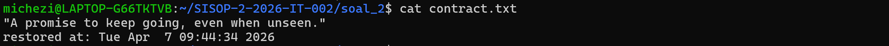
4. Hapus File
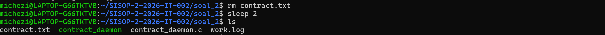
5. Hentikan Daemon
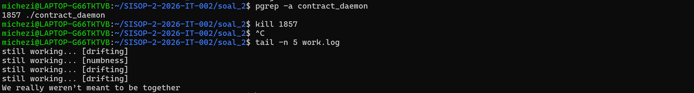

## Soal 3
Pada soal ini, Program daemon diminta:
- Mengubah nama proses menjadi `maya`
- Menulis kalimat random ke `LoveLetter.txt`
- Mengubah isi file menjadi base64
- Mendukung decrypt dan kill
- Menulis log ke `ethereal.log`
### Kode Lengkap
```c
#define _GNU_SOURCE
#include <stdio.h>
#include <stdlib.h>
#include <string.h>
#include <unistd.h>
#include <signal.h>
#include <time.h>
#include <limits.h>
#include <sys/stat.h>
#include <sys/types.h>

volatile sig_atomic_t daemon_running = 1;

char base_dir[PATH_MAX] ;
char love_path[PATH_MAX] ;
char log_path[PATH_MAX] ;
char pid_path[PATH_MAX];

const char *sentences[] = {
        "aku akan fokus pada diriku sendiri",
        "aku mencintaimu dari sekarang hingga selamanya",
        "aku akan menjauh darimu, hingga takdir mempertemukan kita di versi kita yang terbaik",
        "kalau aku dilahirkan kembali, aku tetap akan terus menyayangimu"
} ;

const char base64_table[] = "ABCDEFGHIJKLMNOPQRSTUVWXYZabcdefghijklmnopqrstuvwxyz0123456789+/";

void signal_handler(int sig) {
    daemon_running = 0;
}
void get_log_date(char *datebuf, size_t dsz, char *timebuf, size_t tsz) {
    time_t now = time(NULL);
    struct tm *tm_info = localtime(&now);
    strftime(datebuf, dsz, "%d:%m:%Y", tm_info);
    strftime(timebuf, tsz, "%H:%M:%S", tm_info);
}
void write_log(const char *process_name, const char *status) {
    char datebuf[32], timebuf[32];
    get_log_date(datebuf, sizeof(datebuf), timebuf, sizeof(timebuf));

    FILE *fp = fopen(log_path, "a");
    if (fp != NULL) {
        fprintf(fp, "[%s]-[%s]_%s_%s\n", datebuf, timebuf, process_name, status);
        fclose(fp);
    }
}

int write_text_file(const char *path, const char *content) {
    FILE *fp = fopen(path, "w");
    if (fp == NULL) return 0;
    fputs(content, fp);
    fclose(fp);
    return 1;
}

char *read_text_file(const char *path) {
    FILE *fp = fopen(path, "r");
    if (fp == NULL) return NULL;

    fseek(fp, 0, SEEK_END);
    long size = ftell(fp);
    rewind(fp);

    char *buffer = malloc(size + 1);
    if (buffer == NULL) {
        fclose(fp);
        return NULL;
    }
    fread(buffer, 1, size, fp);
    buffer[size] = '\0';
    fclose(fp);
    return buffer;
}

char *base64_encode(const unsigned char *data, size_t input_length) {
    size_t output_length = 4 * ((input_length + 2) / 3);
    char *encoded = malloc(output_length + 1);
    if (!encoded) return NULL;

    int i = 0, j = 0;
    while (i < (int)input_length) {
        unsigned int octet_a = i < (int)input_length ? data[i++] : 0;
        unsigned int octet_b = i < (int)input_length ? data[i++] : 0;
        unsigned int octet_c = i < (int)input_length ? data[i++] : 0;
        unsigned int triple = (octet_a << 16) + (octet_b << 8) + octet_c;

        encoded[j++] = base64_table[(triple >> 18) & 0x3F];
        encoded[j++] = base64_table[(triple >> 12) & 0x3F];
        encoded[j++] = base64_table[(triple >> 6) & 0x3F];
        encoded[j++] = base64_table[triple & 0x3F];
    }

    int mod = input_length % 3;
    if (mod > 0) {
        encoded[output_length - 1] = '=';
        if (mod == 1) encoded[output_length - 2] = '=';
    }

    encoded[output_length] = '\0';
    return encoded;
}

int base64_index(char c) {
    if ('A' <= c && c <= 'Z') return c - 'A';
    if ('a' <= c && c <= 'z') return c - 'a' + 26;
    if ('0' <= c && c <= '9') return c - '0' + 52;
    if (c == '+') return 62;
    if (c == '/') return 63;
    return -1;
}

char *base64_decode(const char *data, size_t *out_len) {
    size_t len = strlen(data);
    if (len % 4 != 0) return NULL;
    size_t alloc_len = len / 4 * 3;
    if (data[len - 1] == '=') alloc_len--;
    if (data[len - 2] == '=') alloc_len--;
    char *decoded = malloc(alloc_len + 1);
    if (!decoded) return NULL;
    size_t i, j = 0;
    for (i = 0; i < len; i += 4) {
        int a = base64_index(data[i]);
        int b = base64_index(data[i + 1]);
        int c = data[i + 2] == '=' ? 0 : base64_index(data[i + 2]);
        int d = data[i + 3] == '=' ? 0 : base64_index(data[i + 3]);

        unsigned int triple = (a << 18) | (b << 12) | (c << 6) | d;

        decoded[j++] = (triple >> 16) & 0xFF;
        if (data[i + 2] != '=') decoded[j++] = (triple >> 8) & 0xFF;
        if (data[i + 3] != '=') decoded[j++] = triple & 0xFF;
    }

    decoded[j] = '\0';
    if (out_len) *out_len = j;
    return decoded;
}

void setup_paths_from_cwd() {
    if (realpath(".", base_dir) == NULL) {
        perror("realpath");
        exit(EXIT_FAILURE);
    }
    if (chdir(base_dir) != 0) {
        perror("chdir");
        exit(EXIT_FAILURE);
    }
    if (realpath("LoveLetter.txt", love_path) == NULL) {
           FILE *fp = fopen("LoveLetter.txt", "a");
        if (fp != NULL) fclose(fp);
        if (realpath("LoveLetter.txt", love_path) == NULL) {
            perror("realpath LoveLetter.txt");
            exit(EXIT_FAILURE);
        }
    }
    if (realpath("ethereal.log", log_path) == NULL) {
           FILE *fp = fopen("ethereal.log", "a");
        if (fp != NULL) fclose(fp);
        if (realpath("ethereal.log", log_path) == NULL) {
            perror("realpath ethereal.log");
            exit(EXIT_FAILURE);
        }
    }
    if (realpath("angel.pid", pid_path) == NULL) {
               FILE *fp = fopen("angel.pid", "a");
        if (fp != NULL) fclose(fp);
        if (realpath("angel.pid", pid_path) == NULL) {
            perror("realpath angel.pid");
            exit(EXIT_FAILURE);
        }
    }
}

void setup_paths_from_env() {
    const char *env_dir = getenv("ANGEL_BASEDIR");
    if (env_dir == NULL) {
        fprintf(stderr, "ANGEL_BASEDIR tidak ditemukan\n");
        exit(EXIT_FAILURE);
    }
    if (realpath(env_dir, base_dir) == NULL) {
        perror("realpath ANGEL_BASEDIR");
        exit(EXIT_FAILURE);
    }
    if (chdir(base_dir) != 0) {
        perror("chdir");
        exit(EXIT_FAILURE);
    }
    if (realpath("LoveLetter.txt", love_path) == NULL) {
                FILE *fp = fopen("LoveLetter.txt", "a");
        if (fp != NULL) fclose(fp);
        if (realpath("LoveLetter.txt", love_path) == NULL) {
            perror("realpath LoveLetter.txt");
            exit(EXIT_FAILURE);
        }
    }
    if (realpath("ethereal.log", log_path) == NULL) {
                FILE *fp = fopen("ethereal.log", "a");
        if (fp != NULL) fclose(fp);
        if (realpath("ethereal.log", log_path) == NULL) {
            perror("realpath ethereal.log");
            exit(EXIT_FAILURE);
        }
    }
    if (realpath("angel.pid", pid_path) == NULL) {
               FILE *fp = fopen("angel.pid", "a");
        if (fp != NULL) fclose(fp);
        if (realpath("angel.pid", pid_path) == NULL) {
            perror("realpath angel.pid");
            exit(EXIT_FAILURE);
        }
    }
}
void write_pid_file() {
    FILE *fp = fopen(pid_path, "w");
    if (fp != NULL) {
        fprintf(fp, "%d\n", getpid());
        fclose(fp);
    }
}
void remove_pid_file() {
    unlink(pid_path);
}
void do_secret() {
    write_log("secret", "RUNNING");

    const char *chosen = sentences[rand() % 4];
    if (write_text_file(love_path, chosen)) {
        write_log("secret", "SUCCESS");
    } else {
        write_log("secret", "ERROR");
    }
}
void do_surprise() {
    write_log("surprise", "RUNNING");

    char *plain = read_text_file(love_path);
    if (plain == NULL) {
        write_log("surprise", "ERROR");
        return;
    }

    char *encoded = base64_encode((unsigned char *)plain, strlen(plain));
    if (encoded == NULL) {
        free(plain);
        write_log("surprise", "ERROR");
        return;
    }

    if (write_text_file(love_path, encoded)) {
        write_log("surprise", "SUCCESS");
    } else {
        write_log("surprise", "ERROR");
    }

    free(plain);
    free(encoded);
}
void run_daemon_loop() {
    signal(SIGTERM, signal_handler);
    signal(SIGINT, signal_handler);

    write_pid_file();
    srand(time(NULL) ^ getpid());

    while (daemon_running) {
        do_secret();
        do_surprise();

        for (int i = 0; i < 10 && daemon_running; i++) {
            sleep(1);
        }
    }

    remove_pid_file();
}
void start_daemon() {
    char cwd[PATH_MAX];
    if (getcwd(cwd, sizeof(cwd)) == NULL) exit(EXIT_FAILURE);

    setenv("ANGEL_INTERNAL", "1", 1);
    setenv("ANGEL_BASEDIR", cwd, 1);

    pid_t pid = fork();
    if (pid < 0) exit(EXIT_FAILURE);
    if (pid > 0) exit(EXIT_SUCCESS);

    umask(0);
    if (setsid() < 0) exit(EXIT_FAILURE);
    if (chdir("/") < 0) exit(EXIT_FAILURE);

    execl("/proc/self/exe", "maya", NULL);
    exit(EXIT_FAILURE);
}
void decrypt_file() {
    setup_paths_from_cwd();

    write_log("decrypt", "RUNNING");

    char *encoded = read_text_file(love_path);
    if (encoded == NULL) {
        write_log("decrypt", "ERROR");
        printf("LoveLetter.txt tidak ditemukan.\n");
        return;
    }

    size_t out_len;
    char *decoded = base64_decode(encoded, &out_len);
    if (decoded == NULL) {
        write_log("decrypt", "ERROR");
        printf("Gagal decrypt isi file.\n");
        free(encoded);
        return;
    }

    if (write_text_file(love_path, decoded)) {
        write_log("decrypt", "SUCCESS");
        printf("LoveLetter.txt berhasil didecrypt.\n");
    } else {
        write_log("decrypt", "ERROR");
        printf("Gagal menulis hasil decrypt.\n");
    }

    free(encoded);
    free(decoded);
}
void kill_daemon() {
    setup_paths_from_cwd();

    write_log("kill", "RUNNING");

    FILE *fp = fopen(pid_path, "r");
    if (fp == NULL) {
        write_log("kill", "ERROR");
        printf("Daemon tidak sedang berjalan.\n");
        return;
    }

    pid_t pid;
    if (fscanf(fp, "%d", &pid) != 1) {
        fclose(fp);
        write_log("kill", "ERROR");
        printf("PID daemon tidak valid.\n");
        return;
    }
    fclose(fp);

    if (kill(pid, SIGTERM) == 0) {
        write_log("kill", "SUCCESS");
        printf("Daemon berhasil dihentikan.\n");
    } else {
        write_log("kill", "ERROR");
        printf("Gagal menghentikan daemon.\n");
    }
}
void print_usage() {
    printf("Penggunaan:\n");
    printf("./angel -daemon   : jalankan sebagai daemon (nama proses: maya)\n");
    printf("./angel -decrypt  : decrypt LoveLetter.txt\n");
    printf("./angel -kill     : kill proses\n");
}
int main(int argc, char *argv[]) {
    const char *internal = getenv("ANGEL_INTERNAL");

    if (internal != NULL && strcmp(internal, "1") == 0) {
        setup_paths_from_env();
        run_daemon_loop();
        return 0;
    }

    if (argc != 2) {
        print_usage();
        return 0;
    }

    if (strcmp(argv[1], "-daemon") == 0) {
        start_daemon();
    } else if (strcmp(argv[1], "-decrypt") == 0) {
        decrypt_file();
    } else if (strcmp(argv[1], "-kill") == 0) {
        kill_daemon();
    } else {
        print_usage();
    }

    return 0;
}
```
### Penjelasan Kode
#### 1. Menjalankan daemon dan mengganti nama proses
```c
void start_daemon() {
    pid_t pid = fork();
    if (pid > 0) exit(EXIT_SUCCESS);

    umask(0);
    setsid();
    chdir("/");

    execl("/proc/self/exe", "maya", NULL);
}
```
`fork()` dan `setsid()` membuat proses daemon
`execl(..., "maya", NULL)` mengganti nama proses agar tampil sebagai `maya`

#### 2. Fitur secret 
```c
void do_secret() {
    const char *chosen = sentences[rand() % 4];
    write_text_file(love_path, chosen);
}
```
Memilih satu dari 4 kalimat secara acak lalu menulis ke LoveLetter.txt.

#### 3. Fitur surprise (encode base64)
```c
void do_surprise() {
    char *plain = read_text_file(love_path);
    char *encoded = base64_encode((unsigned char *)plain, strlen(plain));
    write_text_file(love_path, encoded);
}
```
Membaca isi `LoveLetter.txt`, mengubahnya ke base64, lalu menimpa isi file.

#### 4. Fitur decrypt
```c
void decrypt_file() {
    char *encoded = read_text_file(love_path);
    char *decoded = base64_decode(encoded, &out_len);
    write_text_file(love_path, decoded);
}
```
Mengubah isi file dari base64 kembali ke teks asli.

#### 5. Fitur kill daemon
```c
void kill_daemon() {
    FILE *fp = fopen(pid_path, "r");
    fscanf(fp, "%d", &pid);
    kill(pid, SIGTERM);
}
```
Membaca PID daemon dari `angel.pid`, lalu menghentikan proses dengan `SIGTERM.`

#### 6. Logging
```c
fprintf(fp, "[%s]-[%s]_%s_%s\n", datebuf, timebuf, process_name, status);
```
Semua aktivitas (secret, surprise, decrypt, kill) dicatat ke `ethereal.log` dengan format:
```
[dd:mm:yyyy]-[hh:mm:ss]_process_STATUS
```
### Cara Menjalankan
```c
./angel -daemon
sleep 5
ps aux | grep '[m]aya'
cat LoveLetter.txt
./angel -kill
sleep 1
./angel -decrypt
cat LoveLetter.txt
```
### Output
1. menjalankan `./angel -daemon`
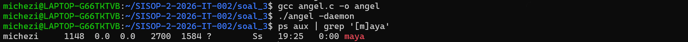
2. melihat `LoveLetter.txt`
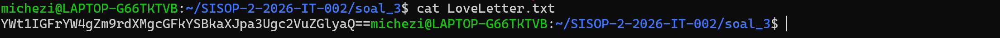
3. melihat `ethereal.log`
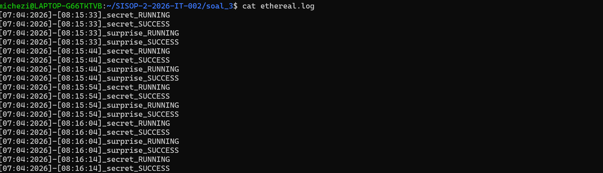
4. menghentikan daemon
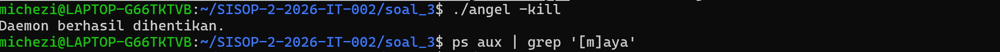
5. Decrypt
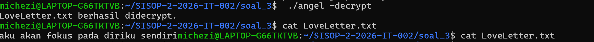
